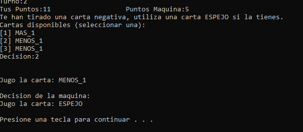

# Pruebas realizadas # 

| Descripción | Salida esperada | Salida obtenida |
| -           | -               | -               | 
|Se quiere comprobar que en la dificultad facil la maquina no distingue que cartas usar sin importar el puntaje del jugador. En este caso, la maquina posee 0 puntos.| Se espera que la maquina juegue cualquier carta cuando el jugador tenga 0 puntos | La salida obtenida fue un menos 1.  |
|Se quiere comprobar que en la dificultad facil la maquina no distingue que cartas usar sin importar el puntaje del jugador. En este caso, la maquina posee 8 puntos.| Se espera que la maquina juegue cualquier carta cuando esta tenga 8 puntos | La salida obtenida fue una carta negativa.  |
|Se quiere comprobar que en la dificultad facil la maquina no distingue que cartas usar sin importar la carta que el jugador haya jugado. En este caso, el jugador utiliza un mas 2.| Se espera que la maquina juegue cualquier carta. | La salida obtenida fue una carta espejo, algo que es ineficiente.  |
|Se quiere comprobar que en la dificultad media la maquina decide que carta usar en base al puntaje del jugador.| Se espera que la maquina no reste puntos cuando el jugador tenga 0 puntos | La salida obtenida fue una carta mas 1  |
|Se quiere comprobar que en la dificultad media la maquina decide que carta usar en base al puntaje del jugador.| Se espera que la maquina se sume puntos al estar cerca de ganar (8 puntos o mas) | La salida obtenida fue una carta mas 1  |
|Se quiere comprobar que en la dificultad dificil la maquina decide que carta usar en base a la carta utilizada por el jugador.| Se espera que la maquina juegue una carta espejo al recibir una carta negativa | La salida obtenida fue una carta espejo  |
|Se quiere comprobar que en la dificultad dificil la maquina decide que carta usar en base al puntaje del jugador.| Se espera que la maquina juegue la carta repetir y luego una carta negativa si el jugador esta cerca de ganar | La salida obtenida fue carta repetir y luego menos 1  |
|Se quiere comprobar que en la dificultad dificil la maquina decide que carta usar en base  las cartas que posee. | Se espera que la maquina juegue la carta repetir y luego una carta positiva si tiene mas de una carta buena | La salida obtenida fue carta repetir y luego mas 2  |
|Se quiere comprobar que al iniciar el juego, no hay un ranking disponible | Se espera que se muestre el ranking vacio con " [] " | La salida obtenida fue " [] " |
|Se quiere comprobar que al ver el ranking despues de varias partidas jugadas, se observan sus ganadores | Se espera que se muestren los ganadores con la cantidad de partidas ganadas por cada uno | La salida obtenida fue las partidas ganadas por Gabriel, Tomás y Marcos |

